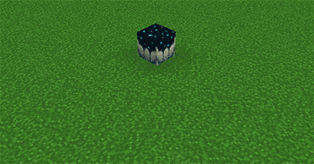

# Sculk Bloom

The `SculkBloom{}` mechanic activates nearby [Sculk Catalyst](https://minecraft.fandom.com/wiki/Sculk\_Catalyst) blocks, which causes a new "bloom." The bloom will turn blocks into sculk blocks, and cause sculk veins to spread, like in the image below:

<figure><figcaption><p>Vanilla Sculk Catalyst</p></figcaption></figure>

| Argument       | Description                                                         | Default Value |
| -------------- | ------------------------------------------------------------------- | ------------- |
| `maxBlocks`    | The maximum number of sculk catalysts to activate.                  | 1             |
| `searchRadius` | How far away, in blocks, to search for the nearest catalyst block.  | 8.0           |
| `charge`       | How much power the sculk bloom will have.                           | 5             |

The `charge` option _roughly translates_ to "how many blocks should we turn into sculk." In Vanilla Minecraft, this value is usually 3-10, but can go up as high as 50.&#x20;


If you set `charge` to high numbers $$>1000$$ can cause multiple cursors to spawn. These cursors may last for multiple minutes! Remember that the **damage from blooms is irreversible**.&#x20;




```yaml
Mechanics:
  - "SculkBloom{}"
```

This tries to find the nearest sculk catalyst in an 8 block radius, and start a bloom on the source player. The bloom will transform \~5 blocks into sculk blocks.&#x20;



```yaml
Mechanics:
  - "SculkBloom{searchRadius=15, repeatAmount=3, repeatInterval=100} @Target{}"
```

This finds the sculk catalyst block that is nearest to the **target location** (in a 15 block radius) and activates it 3 times with a 5 second delay between repetitions. In total, this will transform \~15 blocks into sculk.&#x20;



```yaml
Mechanics:
  - "SculkBloom{maxBlocks=5, charge=10}"
```

This finds the nearest 5 sculk catalysts (in an 8 block radius) and tries to activate them with 10 charges **each**. This means that \~50 blocks will be transformed into sculk. The bloom will be spawned on the source location.&#x20;


